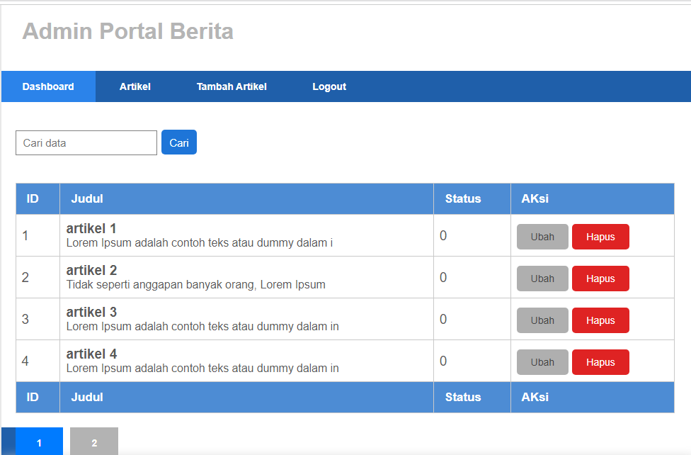
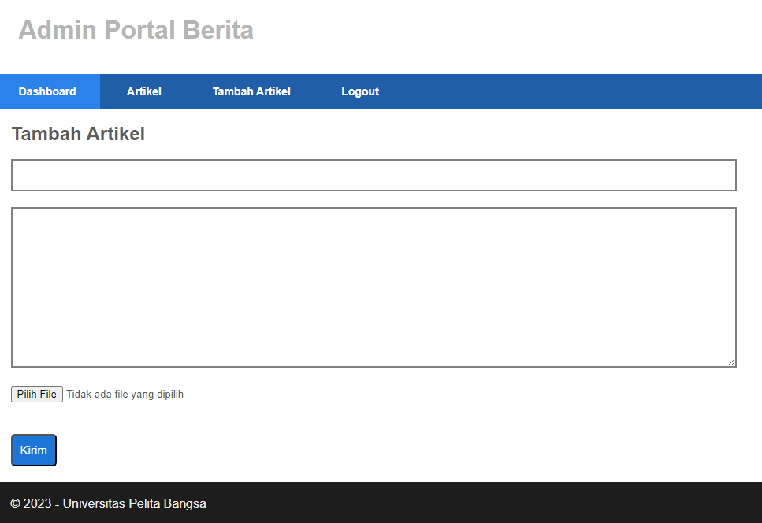
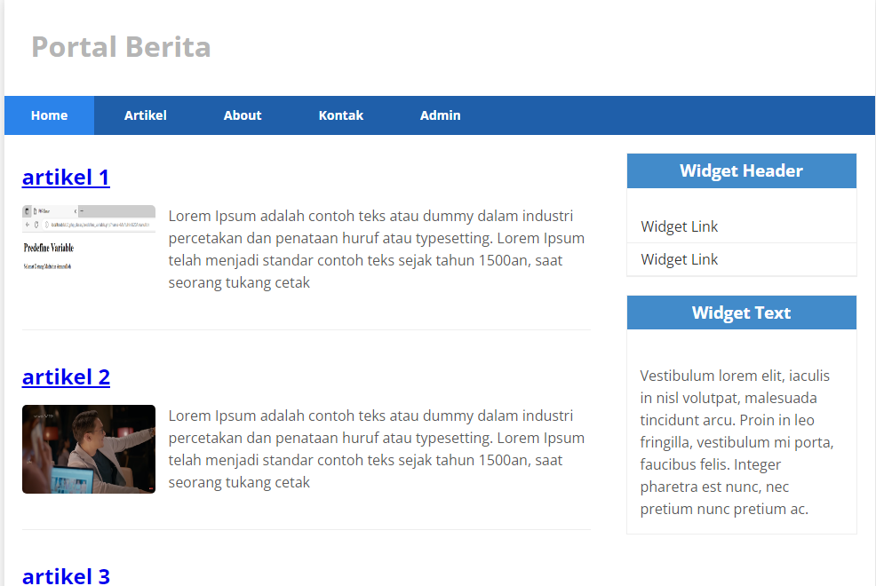

# Tugas Pemrograman Web 2
# Praktikum 11
## Profile
<body>
    <table border="1">
        <tr>
            <th> Nama</th>
            <th>NIM</th>
            <th>Kelas</th>
        </tr>
        <tr>
            <td>Rizal Pringgandani</td>
            <td>312110151</td>
            <td>TI.21.A2</td>
        </tr>
    </table>
</body>

## Intruction
Melanjutkan praktikum sebelumnya pada repository dengan nama **`Lab10Web`**

## Step by Step 


## ubah method add()
Buka kembali Controller Artikel pada project sebelumnya, sesuaikan kode pada method
add seperti berikut:
```

public function add()
   {
    // validasi data.
    $validation = \Config\Services::validation();
    $validation->setRules(['judul' => 'required']);
    $isDataValid = $validation->withRequest($this->request)->run();
    
    if ($isDataValid)
    {
      $file = $this->request->getFile('gambar');
      $file->move(ROOTPATH . 'public/gambar');

       $artikel = new ArtikelModel();
       $artikel->insert([
            'judul' => $this->request->getPost('judul'),
            'isi' => $this->request->getPost('isi'),
            'slug' => url_title($this->request->getPost('judul')),
            'gambar' => $file->getName(),
         ]);
         return redirect('admin/artikel');
    }
    $title = "Tambah Artikel";
    return view('artikel/form_add', compact('title'));
   }
```


## Form add
pada direct views/artikel/form_add.php isikan kode berikut:
```
<h2><?= $title; ?></h2>
<form action="" method="post" enctype="multipart/form-data">
     <p>
        <input type="text" name="judul">
     </p>
     <p>
        <textarea name="isi" cols="50" rows="10"></textarea>
     </p>
       <p>
      <input type="file" name="gambar">
       </p>
      <p><input type="submit" value="Kirim" class="btn btn-large"></p>
</form>
```


- Akses File  dengan url :  http://localhost:8080/user/login 

## Output






## Done
